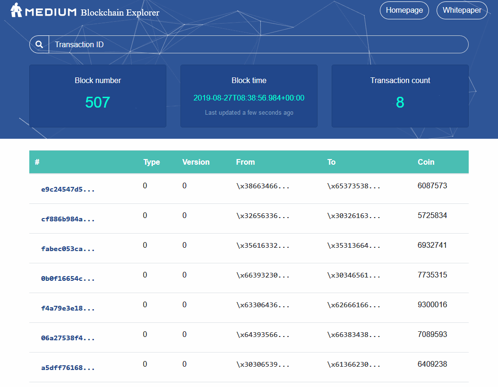
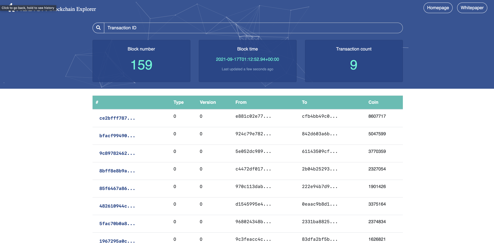
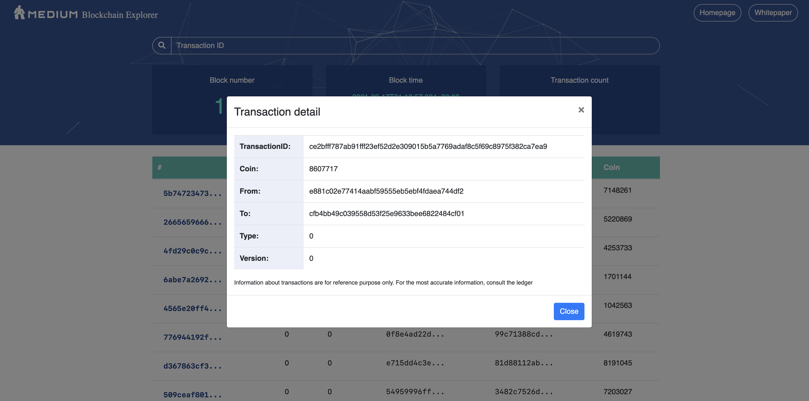

# medium-explorer
Blockchain explorer for Medium platform

[](docs/demo.gif)

# Requirements

## Using docker
- Docker only!

## Manual install
See **How to Run**

# How to run
## Automatically

```
cd docker-medium-explorer
docker-compose up -d
```

(It takes about 3 minutes to start on a 2019 MBP i9 16GB RAM)

Access the front-end at [https://localhost:3030](https://localhost:3030)

## Manually
Install
- Node v10
- Yarn
- PosgreSQL v11
- Hasura 1.0.0 beta 4 or later
Execute these commands in sequence

### Database
```
docker-compose run timescale -d
docker-compose run graphql-engine -d
```

### Front-end

```
cd front-end
yarn
yarn run start
```

Then go to [https://localhost:3000](https://localhost:3000)

### Back-end
Currently only push mock data to database

```
cd back-end
pnpm i
node index.js
```

# Troubleshoot

## graphql-engine failed to start
Adjust amount of memory available to Docker. Should be at least 4GB, ideally 8GB

## mock or front-end failed to start
Check if docker can access the Internet by going into the containers and run `npm install`

## Exporting hasura schema

```
npm install -g apollo
apollo schema:download --endpoint https://my-graphql-engine.com/v1/graphql --header 'X-Hasura-Admin-Secret: adminsecretkey'
```

[Read more here](https://docs.hasura.io/1.0/graphql/manual/schema/export-graphql-schema.html)

## Screenshots




